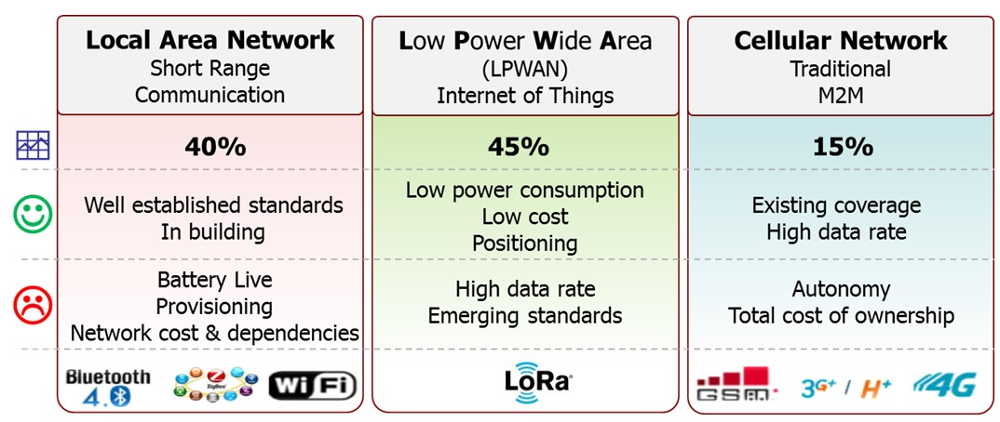
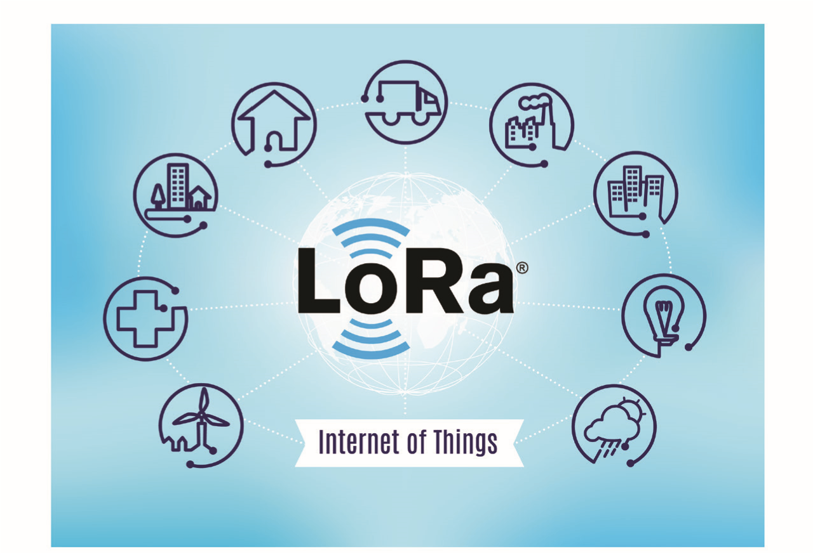
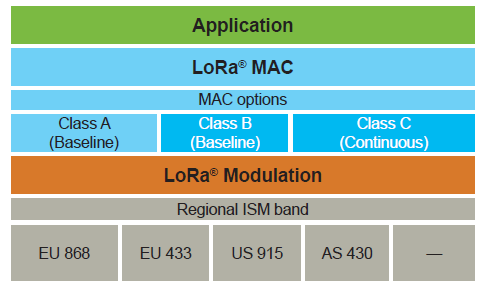
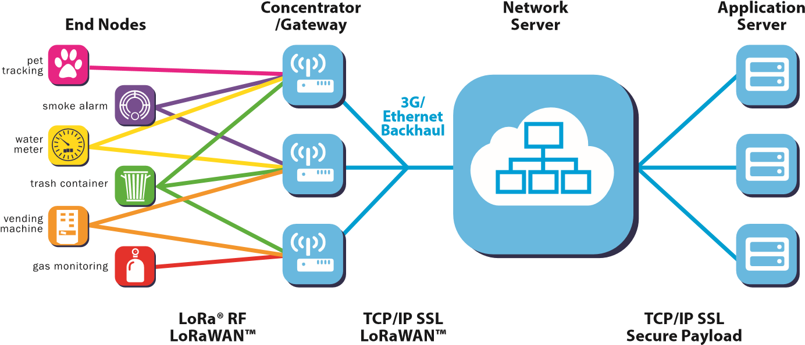
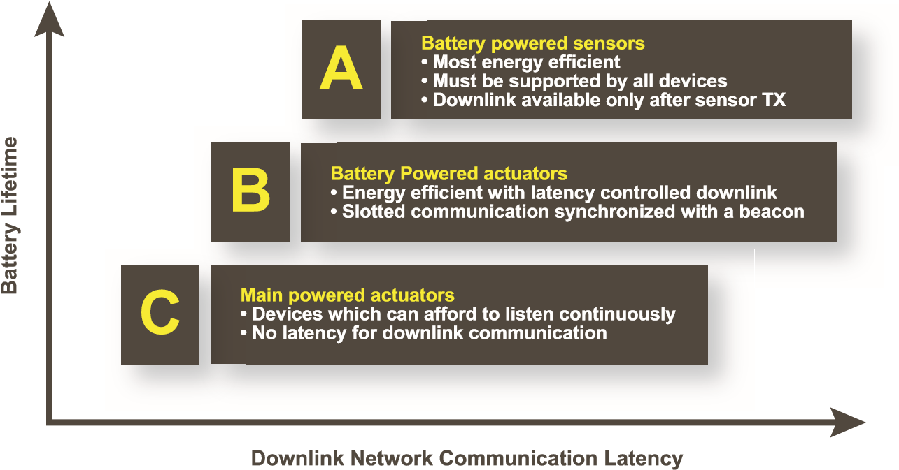
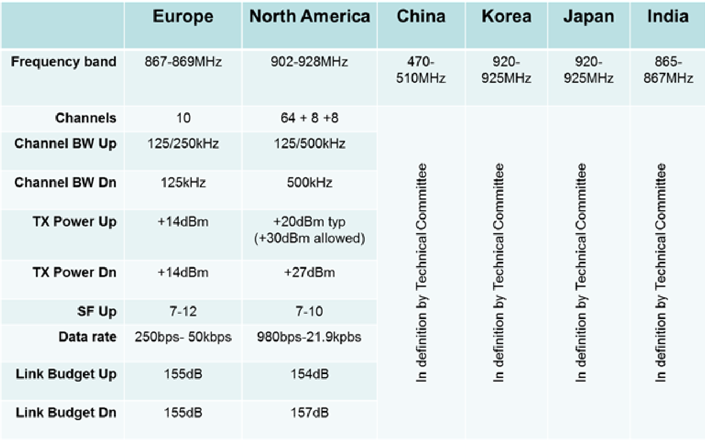
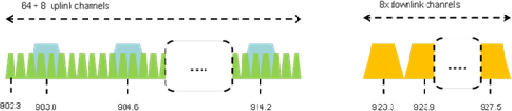

# Overview

## **WHAT IS LoRa®?**

LoRa® is the physical layer or the wireless modulation utilized to create the long range communication link. Many legacy wireless systems use frequency shifting keying \(FSK\) modulation as the physical layer because it is a very efficient modulation for achieving low power. LoRa® is based on chirp spread spectrum modulation, which maintains the same low power characteristics as FSK modulation but significantly increases the communication range. Chirp spread spectrum has been used in military and space communication for decades due to the long communication distances that can be achieved and robustness to interference, but LoRa® is the first low cost implementation for commercial usage.

### **Long Range \(LoRa**®**\)**

The advantage of LoRa® is in the technology’s long range capability. A single gateway or base station can cover entire cities or hundreds of square kilometers. Range highly depends on the environment or obstructions in a given

location, but LoRa® and LoRaWAN™ have a link budget greater than any other standardized communication technology. The link budget, typically given in decibels \(dB\), is the primary factor in determining the range in a given environment. Below are the coverage maps from the Proximus network deployed in Belgium. With a minimal amount of infrastructure, entire countries can easily be covered.

## **WHERE DOES LPWAN FIT?**

One technology cannot serve all of the projected applications and volumes for IoT. WiFi and BTLE are widely adopted standards and serve the applications related to communicating personal devices quite well. Cellular technology is a great fit for applications that need high data throughput and have a power source. LPWAN offers multi-year battery lifetime and is designed for sensors and applications that need to send small amounts of data over long distances a few times per hour from varying environments

## **IMPORTANT FACTORS IN LPWAN**

**The most critical factors in an LPWAN are:**

* **Network architecture**
* **Communication range**
* **Battery lifetime or low power**
* **Robustness to interference**
* **Network capacity \(maximum number of nodes in a network\)**
* **Network security**
* **One-way vs two-way communication**
* **Variety of applications served**

## **WHAT IS LoRaWAN™?**

LoRaWAN™ defines the communication protocol and system architecture for the network while the LoRa® physical layer enables the long-range communication link. The protocol and network architecture have the most influence in determining the battery lifetime of a node, the network capacity, the quality of service, the security, and the variety of applications served by the network.

### **Network Architecture**

Many existing deployed networks utilize a mesh network architecture. In a mesh network, the individual end-nodes forward the information of other nodes to increase the communication range and cell size of the network. While this increases the range, it also adds complexity, reduces network capacity, and reduces battery lifetime as nodes receive and forward information from other nodes that is likely irrelevant for them. Long range star architecture makes the most sense for preserving battery lifetime when long-range connectivity can be achieved.

### **Application Data**

In a LoRaWAN™ network nodes are not associated with a specific gateway. Instead, data transmitted by a node is typically received by multiple gateways. Each gateway will forward the received packet from the end-node to the cloud-based network server via some backhaul \(either cellular, Ethernet, satellite, or Wi-Fi\). The intelligence and complexity is pushed to the network server, which manages the network and will filter redundant received packets, perform security checks, schedule acknowledgments through the optimal gateway, and perform adaptive data rate, etc. If a node is mobile or moving there is no handover needed from gateway to gateway, which is a critical feature to enable asset tracking applications–a major target application vertical for IoT.

### **Battery Lifetime**

The nodes in a LoRaWAN™ network are asynchronous and communicate when they have data ready to send whether event-driven or scheduled. This type of protocol is typically referred to as the Aloha method. In a mesh network or with a synchronous network, such as cellular, the nodes frequently have to ‘wake up’ to synchronize with the network and check for messages. This synchronization consumes significant energy and is the number one driver of battery lifetime reduction. In a recent study and comparison done by GSMA of the various technologies addressing the LPWAN space, LoRaWAN™ showed a 3 to 5 times advantage compared to all other technology options.

### **Network Capacity**

In order to make a long range star network viable, the gateway must have a very high capacity or capability to receive messages from a very high volume of nodes. High network capacity in a LoRaWAN™ network is achieved by utilizing adaptive data rate and by using a multichannel multi-modem transceiver in the gateway so that simultaneous messages on multiple channels can be received. The critical factors effecting capacity are the number of concurrent channels, data rate \(time on air\), the payload length, and how often nodes transmit. Since LoRa® is a spread spectrumbased modulation, the signals are practically orthogonal to each other when different spreading factors are utilized. As the spreading factor changes, the effective data rate also changes. The gateway takes advantage of this property by being able to receive multiple different data rates on the same channel at the same time. If a node has a good link and is close to a gateway, there is no reason for it to always use the lowest data rate and fill up the available spectrum longer than it needs to. By shifting the data rate higher, the time on air is shortened opening up more potential space for other nodes to transmit. Adaptive data rate also optimizes the battery lifetime of a node. In order to make adaptive data rate work, symmetrical up link and down link is required with sufficient downlink capacity. These features enable a LoRaWAN™ network to have a very high capacity and make the network scalable. A network can be deployed with a minimal amount of infrastructure, and as capacity is needed, more gateways can be added, shifting up the data rates, reducing the amount of overhearing to other gateways, and scaling the capacity by 6-8x. Other LPWAN alternatives do not have the scalability of LoRaWAN™ due to technology trade-offs, which limit downlink capacity or make the downlink range asymmetrical to the uplink range.

### **Device Classes – Not All Nodes Are Created Equal**

End-devices serve different applications and have different requirements. In order to optimize a variety of end application profiles, LoRaWAN™ utilizes different device classes. The device classes trade off network downlink communication latency versus battery lifetime. In a control or actuator-type application, the downlink communication latency is an important factor.

Bi-directional end-devices \(Class A\): End-devices of Class A allow for bi-directional communications whereby each end-device’s uplink transmission is followed by two short downlink receive windows. The transmission slot scheduled by the end-device is based on its own communication needs with a small variation based on a random time basis \(ALOHA-type of protocol\). This Class A operation is the lowest power end-device system for applications that only require downlink communication from the server shortly after the end-device has sent an uplink transmission. Downlink communications from the server at any other time will have to wait until the next scheduled uplink.

Bi-directional end-devices with scheduled receive slots \(Class B\): In addition to the Class A random receive windows, Class B devices open extra receive windows at scheduled times. In order for the end-device to open its receive window at the scheduled time, it receives a time-synchronized beacon from the gateway. This allows the server to know when the end-device is listening.

Bi-directional end-devices with maximal receive slots \(Class C\): End-devices of Class C have almost continuously open receive windows, only closed when transmitting.

**Security**

It is extremely important for any LPWAN to incorporate security. LoRaWAN™ utilizes two layers of security: one for the network and one for the application. The network security ensures authenticity of the node in the network while the application layer of security ensures the network operator does not have access to the end user’s application data. AES encryption is used with the key exchange utilizing an IEEE EUI64 identifier.

There are trade-offs in every technology choice but the LoRaWAN™ features in network architecture, device classes, security, scalability for capacity, and optimization for mobility address the widest variety of potential IoT applications.

## **LoRaWAN™ REGIONAL SUMMARY**

The LoRaWAN™ specification varies slightly from region to region based on the different regional spectrum allocations and regulatory requirements. The LoRaWAN™ specification for Europe and North America are defined, but other regions are still being defined by the technical committee. Joining the LoRa® Alliance as a contributor member and participating in the technical committee can have significant advantages to companies targeting solutions for the Asia market.

### **LoRaWAN™ for Europe**

LoRaWAN™ defines ten channels, eight of which are multi data rate from 250bps to 5.5 kbps, a single high data rate LoRa® channel at 11kbps, and a single FSK channel at 50kbps. The maximum output power allowed by ETSI in Europe is +14dBM, with the exception of the G3 band which allows +27dBm. There are duty cycle restrictions under ETSI but no max transmission or channel dwell time limitations.

### **LoRaWAN™ for North America**

The ISM band for North America is from 902-928MHz. LoRaWAN™ defines 64, 125kHz uplink channels from 902.3 to 914.9MHz in 200kHz increments. There are an additional eight 500KHz uplink channels in 1.6MHz increments from 903MHz to 914.9MHz. The eight downlink channels are 500kHz wide starting from 923.3MHz to 927.5MHz. The maximum output power in North America 902-928MHz band is +30dBm but for most devices +20dBm is sufficient. Under FCC there are no duty cycle limitations but there is a 400msec max dwell time per channel.

### **LoRaWAN™ Hybrid mode for North America**

Most people are familiar with the frequency hopping requirements for FCC, which require greater than 50 channels to be utilized equally in the ISM band. LoRaWAN™ is defined with more than 50 channels to take advantage of the available spectrum and allow maximum output power.

LoRa® modulation qualifies as a digital modulation technique so it is exempt from having to comply with all the frequency hopping requirements specified by FCC under a Hybrid mode of operation. In Hybrid mode, the maximum output power is limited to +21dBm and only a subset of eight channels out of the 64 uplink channels is utilized under Hybrid mode.

From the FCC:

“A hybrid system uses both digital modulation and frequency hopping techniques at the same time on the same carrier. As shown in Section 15.247\(f\), a hybrid system must comply with the power density standard of 8 dBm in any 3 kHz band when the frequency hopping function is turned off. The transmission also must comply with a 0.4 second / channel maximum dwell time when the hopping function is turned on. There is no requirement for this type of hybrid system to comply with the 500 kHz minimum bandwidth normally associated with a DTS transmission; and, there is no minimum number of hopping channels associated with this type of hybrid system.”

## **COMPARING LPWAN TECHNOLOGY OPTIONS**

There is a lot of activity in the IoT sector comparing LPWAN options both from a technical comparison but also from a business model perspective. LPWAN networks are being deployed now because there is a strong business case to support immediate deployment, and the cost to deploy the network in unlicensed bands requires much less capital than even a 3G software upgrade. The questions that should be answered to compare different LPWAN technologies are:

* Flexibility to target a large variety of applications
* Is the communication protocol secure?
* Technical aspects – range, capacity, two-way communication, robustness to interference
* Cost of network deployment, cost of end-node BOM, cost of battery \(largest BOM contributor\)
* Ecosystem of solutions providers for flexible business models
* Availability of end-products to ensure ROI of network deployment
* Strength of ecosystem to ensure quality and longevity of the solution

