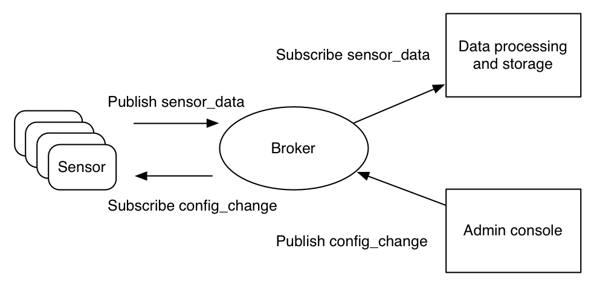
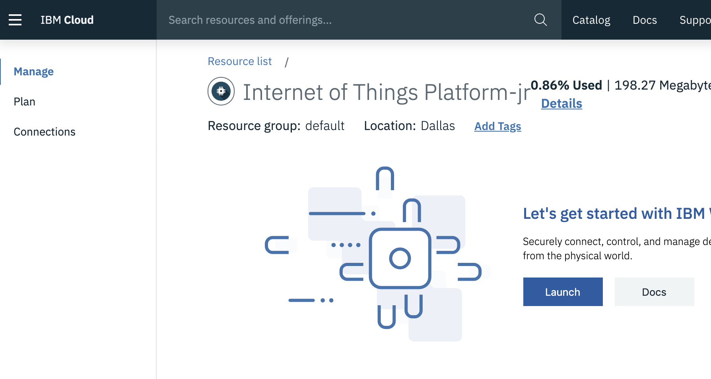
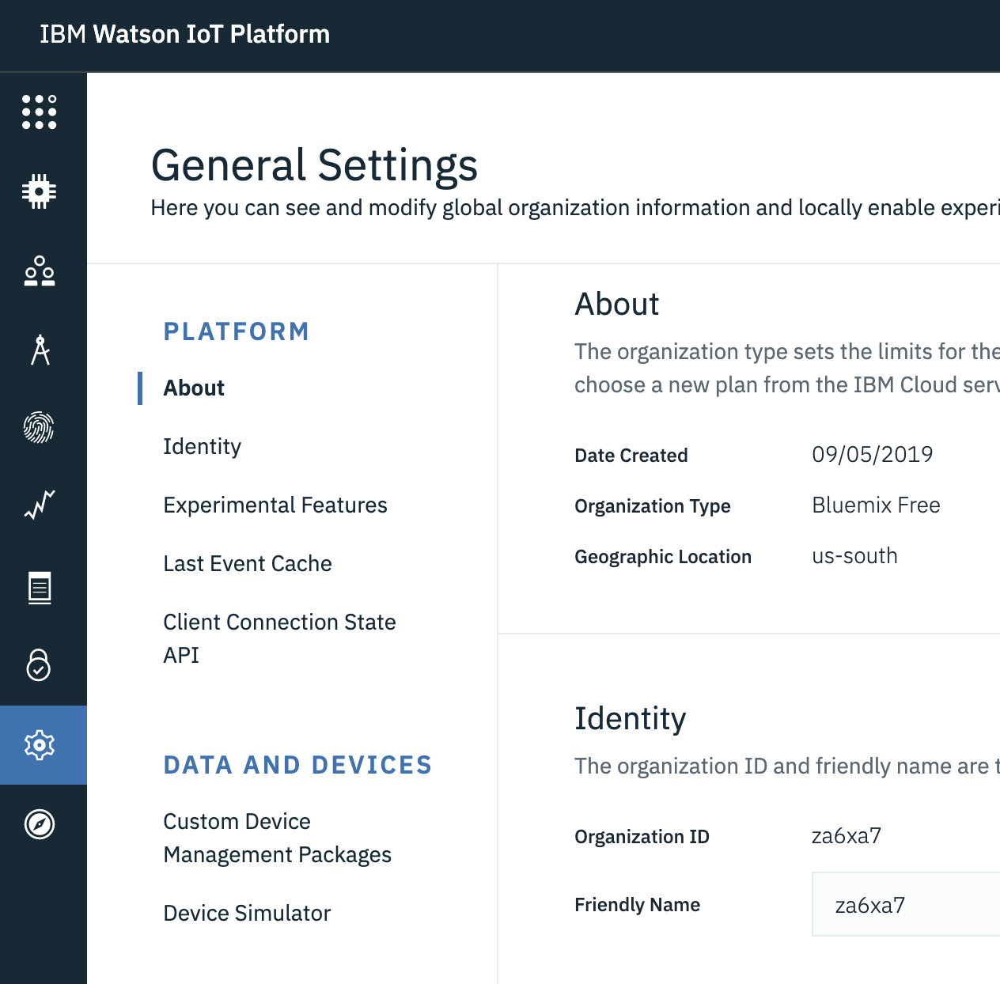
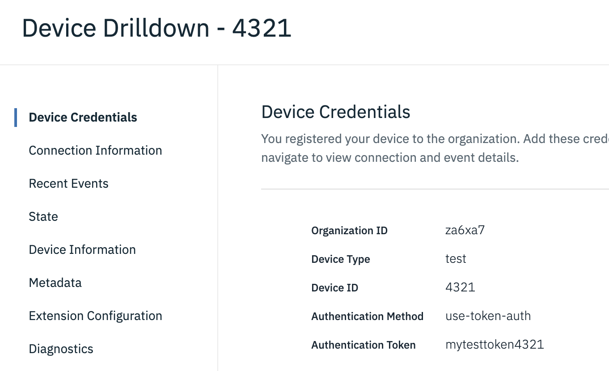
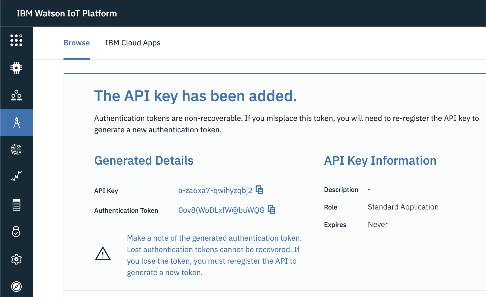

# MQTT

For Internet of Things \(IoT\) devices, connecting to the Internet is kind of a requirement. Connecting to the Internet allows the devices to work with each other and with backend services. The underlying network protocol of the Internet is TCP/IP. Built on top of the TCP/IP stack, MQTT \(Message Queue Telemetry Transport\) has become the standard for IoT communications. MQTT can also run on SSL/TLS, which is a secure protocol built on TCP/IP, to ensure that all data communication between devices are encrypted and secure.

MQTT was originally invented and developed by IBM in the late 1990’s. Its original application was to link sensors on oil pipelines with satellites. As its name suggests, it is a messaging protocol that supports asynchronous communication between parties. An asynchronous messaging protocol de-couples the message sender and receiver in both space and time, and hence is scalable in unreliable network environments.

Despite its name, it actually has nothing to do with messaging queues, and uses a publish and subscribe model instead. In late 2014, it officially became an OASIS open standard, and it is supported in popular programming languages by using multiple open source implementations.

## What is MQTT and why should I use it? 

MQTT is a lightweight and flexible network protocol that strikes the right balance for IoT developers:

* The lightweight protocol allows it to be implemented on both heavily constrained device hardware as well as high latency / limited bandwidth networks.
* Its flexibility makes it possible to support diverse application scenarios for IoT devices and services.

To understand why MQTT is such a good fit for IoT developers, let’s first examine why other popular network protocols failed in IoT.

## Why not … the rest of the alphabet soup of network protocols 

Most developers are already familiar with HTTP web services. So, why not just have IoT devices connect to web services? The device could send in its data as a HTTP request and receive updates from the system as the HTTP response. This request and response pattern does have some severe limitations:

* HTTP is a synchronous protocol. The client waits for the server to respond. That is a requirement for web browsers, but it comes at the cost of poor scalability. In the world of IoT, the large number of devices and most likely an unreliable / high latency network have made synchronous communication problematic. An asynchronous messaging protocol is much more suitable for IoT applications. The sensors can send in readings, and let the network figure out the optimal path and timing for delivery to its destination devices and services.
* HTTP is one-way. The client must initiate the connection. In an IoT application, the devices or sensors are typically clients, which means that they cannot passively receive commands from the network.
* HTTP is a 1-1 protocol. The client makes a request, and the server responds. It is difficult and expensive to broadcast a message to all devices on the network, which is a common use case in IoT applications.
* HTTP is a heavy weight protocol with many headers and rules. It is not suitable for constrained networks.

For the above reasons, most high performance scalable systems use an asynchronous messaging bus, rather than web services, for internal data exchange. In fact, the most popular messaging protocol used in enterprise middleware systems is called AMQP \(Advanced Message Queuing Protocol\). However, in the high-performance environment, computing power and network latency are typically not a concern. AMQP is designed for reliability and interoperability in enterprise applications. It has a rich feature set, but it is not suitable for resource-constrained IoT applications.

Besides AMQP, there are other popular messaging protocols. For example, the XMPP \(Extensible Messaging and Presence Protocol\) is a peer-to-peer instant messaging \(IM\) protocol. It is heavy on features that support IM use cases, such as presence and media attachments. Compared with MQTT, it requires much more resources both on the device and on the network.

So, what makes the MQTT so lightweight and flexible? A key feature of the MQTT protocol is its publish and subscribe model. As with all messaging protocols, it decouples the publisher and consumer of data.

## The publish and subscribe model 

The MQTT protocol defines two types of entities in the network: a message broker and a number of clients. The broker is a server that receives all messages from the clients and then routes those messages to relevant destination clients. A client is anything that can interact with the broker to send and receive messages. A client could be an IoT sensor in the field or an application in a data center that processes IoT data.

1. The client connects to the broker. It can subscribe to any message “topic” in the broker. This connection can be a plain TCP/IP connection or an encrypted TLS connection for sensitive messages.
2. The client publishes messages under a topic by sending the message and topic to the broker.
3. The broker then forwards the message to all clients that subscribe to that topic.

Since MQTT messages are organized by topics, the application developer has the flexibility to specify that certain clients can only interact with certain messages. For example, sensors will publish their readings under the “sensor\_data” topic, and subscribe to the “config\_change” topic. Data processing applications that save sensor data into a backend database will subscribe to the “sensor\_data” topic. An admin console application could receive system admin’s commands to adjust the sensors’ configurations, such as sensitivity and sample frequency, and publish those changes to the “config\_change” topic.

At the same time, MQTT is lightweight. It has a simple header to specify the message type, a text-based topic, and then an arbitrary binary payload. The application can use any data format for the payload, such as JSON, XML, encrypted binary, or Base64, as long as the destination clients can parse the payload.

## Getting started with MQTT development 

The easiest tool to get started with MQTT development is the mosquitto module, which is part of the Eclipse project that provides MQTT SDKs and libraries in multiple programming languages. It contains an MQTT broker that can run on your local computer and command line tools to interact with the broker by using messages.

You can download and install the module from the [mosquitto web site](https://mosquitto.org/). Make sure that you install both the mosquitto \(the broker\) and the mosquitto\_clients \(the clients\) modules.

The install command on Ubuntu Linux is as follows.

`$ sudo apt-get install mosquitto mosquitto-clients`

The install command on RedHat Linux is as follows.

`$ sudo yum -y install epel-release` `$ sudo yum -y install mosquitto`

The mosquitto command runs the MQTT broker on your local computer. You could optionally use the -d option to run it in the background.

`$ mosquitto -d`

Alternatively, you could run it as a system service.

`$ systemctl start mosquitto`

Next, in another terminal window, you can use the mosquitto\_sub command to connect to the local broker and subscribe to a topic. Once the command executes, it will wait and print out any message it receives via the subscription as they come in.

`$ mosquitto_sub -t "dw/demo"`

In yet another terminal window, you can use the mosquitto\_pub command to connect to the local broker and then publish a message to a topic.

`$ mosquitto_pub -t "dw/demo" -m "hello world!"`

Now, the terminal that runs mosquitto\_sub should now print out hello world! on the screen. You have just sent and received a message via an MQTT broker!

For more options on how to use the mosquitto tools, as well as on how to use the mosquitto API to create your own MQTT client applications, please refer to its [documentation](https://mosquitto.org/documentation/).

## Using the IBM Internet of Things Platform as an MQTT broker 

Of course, in a production system, you cannot use a local computer as your broker. The [IBM Internet of Things \(IoT\) Platform](https://cloud.ibm.com/catalog/services/internet-of-things-platform?cm_sp=ibmdev-_-developer-articles-_-cloudreg) provides a reliable and on-demand service that functions like a MQTT broker. The IBM IoT Platform service enhances the standard MQTT broker in several different ways: it provides last event cache; allows configuration of data persistence; supports device management protocols; and provides analytics capabilities.

From the IBM Cloud console, click on **Catalog**, **Internet of Things**, and then select the **Internet of Things Platform**. From there, you can choose a service plan. The Lite plan is free of charge and provides enough capability for most small projects.

Once you create an IoT platform service instance, you can click on the “Launch” button from the “manage” section to launch it.

Note down the “Organization ID” of your platform instance in the Settings screen. I have “za6xa7” for my Lite instance. The organization ID is also in the management console’s URL: `https://za6xa7.internetofthings.ibmcloud.com/`.

Next, in the Devices section, you can create a new device. The device has a type and an ID. Here, we create a device of test type and 4321 ID.

Finally, you can create two applications to send messages on behalf of the device and to receive device messages for processing. Each application has an ID and an access token.

Before we could use the mosquitto commands to connect to the MQTT broker at IBM IoT Platform, we need the following connection settings.

* The MQTT broker host is za6xa7.messaging.internetofthings.ibmcloud.com. Notice the za6xa7 is the organization ID for the service instance.
* You will need a certificate file to initiate a secure TLS connection to the broker. TLS is required for IBM IoT Platform by default, as the access credentials should be encrypted over the network. The content of the file messaging.pem is here: `https://github.com/ibm-watson-iot/iot-python/blob/master/src/wiotp/sdk/messaging.pem`

Now, use the following command line to subscribe to status events for the device we just created from one of our applications. Notice that it uses a TLS encrypted channel at port 8883 and trusts the server certificate in messaging.pem.

`$ mosquitto_sub -t "iot-2/type/test/id/4321/evt/status/fmt/+" -h za6xa7.messaging.internetofthings.ibmcloud.com -p 8883 --cafile messaging.pem -u a-za6xa7-bwrus5qab4 -P auth-token-here -i a:za6xa7:test2`

Then, use the following command to send a JSON message to the device event from another application.

`$ mosquitto_pub -t "iot-2/type/test/id/4321/evt/status/fmt/json" -m "{\"mesg\" : \"hello IBM\"}" -h za6xa7.messaging.internetofthings.ibmcloud.com -p 8883 --cafile messaging.pem -u a-za6xa7-lxmzussonj -P auth-token-here -i a:za6xa7:test1`

The mosquitto\_sub command window above should now print the message to the console.

Now that you have the necessarily tools, let’s dive deeper into the MQTT protocol.

## Understanding the MQTT protocol 

MQTT is a wire protocol that specifies how data bytes should be organized and transmitted over the TCP/IP network. But for practical purposes, developers do not need to understand the wire protocol. All we need to know is that each message has a command and data payload. The command defines the message type \(for example, a CONNECT message or a SUBSCRIBE message\). All MQTT libraries and tools provide simple ways to manipulate those messages directly and can automatically populate some required fields, such as message and client IDs.

First, the client connects to the broker by sending a CONNECT message. The CONNECT message asks to establish a connection from the client to the broker. The CONNECT message has the following content parameters.

### Table 1. CONNECT message parameters 

|  **Parameter** |  **Description** |
| :--- | :--- |
|  cleanSession |  This flag specifies whether the connection is persistent or not. A persistent session stores all the subscriptions and potentially missed messages \(depending on QoS\) in the broker. \(I discuss QoS later.\) |
|  username |  The broker’s authentication and authorization credentials. |
|  password |  The broker’s authentication and authorization credentials. |
|  lastWillTopic |  When the connection is dropped unexpectedly, the broker will automatically publish a “last will” message to a topic. |
|  lastWillQos |  The “last will” message’s QoS. \(I discuss QoS later.\) |
|  lastWillMessage |  The “last will” message itself. |
|  keepAlive |  This is the time interval that the client needs to ping the broker to keep the connection alive. |

The client will receive a CONNACK message from the broker. The CONNACK message has the following content parameters.

### Table 2. CONNACK message parameters 

|  **Parameter** |  **Description** |
| :--- | :--- |
|  sessionPresent |  This indicates whether the connection already has a persistent session. That is, the connection already has subscribed topics, and will receive the delivery of missed messages. |
|  returnCode |  0 indicates success. Other values identify the cause of failure. |

After a connection is established, the client can then send one or more SUBSCRIBE message to the broker to indicate that it will receive messages from the broker for certain topics. The message can have one or multiple repeats of the following parameters.

### Table 3. SUBSCRIBE message parameters 

<table>
  <thead>
    <tr>
      <th style="text-align:left"> <b>Parameter</b>
      </th>
      <th style="text-align:left"> <b>Description</b>
      </th>
    </tr>
  </thead>
  <tbody>
    <tr>
      <td style="text-align:left">qos</td>
      <td style="text-align:left">
        
The qos (quality of service, or QoS) flag indicates how consistently the
          messages under this topic needs to be delivered to clients.
           
        

        <ul>
          <li>Value 0: Unreliable, the message is delivered at most once, if the client
            is unavailable at the time, it will miss the message.</li>
          <li>Value 1: the message should be delivered at least once.</li>
          <li>Value 2: the message should be delivered exactly once.</li>
        </ul>
      </td>
    </tr>
    <tr>
      <td style="text-align:left">topic</td>
      <td style="text-align:left">A topic to subscribe to. A topic can have multiple levels separated by
        the slash character. For example, &#x201C;dw/demo&#x201D; and &#x201C;ibm/cloud/mqtt&#x201D;
        are valid topics.</td>
    </tr>
  </tbody>
</table>

After a client has successfully subscribed to a topic, the broker returns a SUBACK message with one or more returnCode parameters.

### Table 4. SUBACK message parameters 

<table>
  <thead>
    <tr>
      <th style="text-align:left"> <b>Parameter</b>
      </th>
      <th style="text-align:left"> <b>Description</b>
      </th>
    </tr>
  </thead>
  <tbody>
    <tr>
      <td style="text-align:left">returnCode</td>
      <td style="text-align:left">
        
A return code exists for each of the topics in the SUBCRIBE command. The
          return values are as follows.
           
        

        <ul>
          <li>Values 0 &#x2013; 2: success with the corresponding QoS level. (See for
            more about QoS.)</li>
          <li>Value 128: failure.</li>
        </ul>
      </td>
    </tr>
  </tbody>
</table>

Corresponding to the SUBSCRIBE message, the client can also UNSUBSCRIBE from a topic or multiple topics.

### Table 5. UNSUBSCRIBE message parameters 

|  **Parameter** |  **Description** |
| :--- | :--- |
|  topic |  This parameter can repeat for multiple topics. |

The client can send PUBLISH messages to the broker. The message contains a topic and data payload. The broker then forwards the message to all clients that subscribe to that topic.

### Table 6. PUBLISH message parameters 

|  **Parameter** |  **Description** |
| :--- | :--- |
|  topicName |  The topic under which the message is published. |
|  qos |  The quality of service level of the message delivery. \(See for a description of QoS.\) |
|  retainFlag |  This flag indicates whether the broker will retain the message as the last known message for this topic. |
|  payload |  The actual data in the message. It can be a text string or a binary blob of data. |

## Tips and workarounds 

The power of MQTT is its simplicity. You have no constraints on the kind of topics or message payloads that you can use. That allows for some interesting use cases. For example, consider these questions:

_How do I do 1-1 messages with MQTT?_ Both parties can agree to use a topic that is unique to them. For example, the topic name could contain the IDs of both clients to ensure its uniqueness.

_How does a client broadcast its presence status?_ The system could have an agreed upon naming convention for “presence” topics. For example, the “presence/client-id” topic could have the presence information for a client. The client sets the message to true when it connects and false when it disconnects. The client can also set a last will message to false so that it is set when the connection drops. The message can be retained by the broker so that new clients can read the topic and find out the presence status.

_How do I secure the communications?_ The client-to-broker connection can be an encrypted TLS connection to protect the data in transit. In addition, since the MQTT protocol imposes no constraints on the payload data format, the system could have an agreed upon encryption method and key update mechanism. After that, all content in the payload could be encrypted binary data of the actual JSON or XML messages.

## Conclusion 

In this article, I gave a technical introduction to the MQTT protocol. You learned what is MQTT, what makes MQTT suitable for IoT applications, and how to get started with developing apps that use MQTT.

